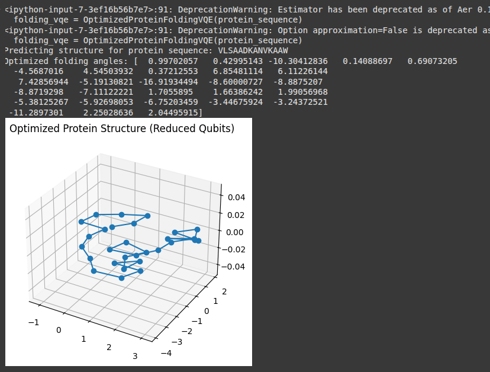

Optimized VQE for Protein Folding
=================================

This section demonstrates a reduced-qubit, resource-optimized approach for solving the protein folding problem using the Variational Quantum Eigensolver (VQE). Unlike the full-size implementation, this version:

- Uses only ``N`` qubits for a protein of length ``N``.
- Applies a simplified Hamiltonian using nearest-neighbor Pauli ``ZZ`` interactions.
- Reduces ansatz complexity with fewer repetitions.
- Executes with fewer shots to speed up simulation.

Code Summary
------------

.. code-block:: python

    protein_sequence = "VLSAADKANVKAAW"  # Shortened for testing
    folding_vqe = OptimizedProteinFoldingVQE(protein_sequence)
    folding_vqe.predict_structure()

Console Output
--------------

.. code-block:: text

    <ipython-input-7-3ef16b56b7e7>:91: DeprecationWarning: Estimator has been deprecated as of Aer 0.15, please use EstimatorV2 instead.
      folding_vqe = OptimizedProteinFoldingVQE(protein_sequence)
    <ipython-input-7-3ef16b56b7e7>:91: DeprecationWarning: Option approximation=False is deprecated as of qiskit-aer 0.13. It will be removed no earlier than 3 months after the release date. Instead, use BackendEstimator from qiskit.primitives.
      folding_vqe = OptimizedProteinFoldingVQE(protein_sequence)

    Predicting structure for protein sequence: VLSAADKANVKAAW
    Optimized folding angles: 
    [  0.99702057   0.42995143 -10.30412836   0.14088697   0.69073205
      -4.5687016    4.54503932   0.37212553   6.85481114   6.11226144
       7.42856944  -5.19130821 -16.91934494  -8.60000727  -8.8875207
      -8.8719298   -7.11122221   1.7055895    1.66386242   1.99056968
      -5.38125267  -5.92698053  -6.75203459  -3.44675924  -3.24372521
     -11.2897301    2.25028636   2.04495915]

.. warning::

    The current implementation uses the deprecated ``AerEstimator``. It is recommended to migrate to `EstimatorV2` or `BackendEstimator` from ``qiskit.primitives`` in future versions to ensure forward compatibility.

Protein Structure Visualization
-------------------------------

The resulting 3D structure below is generated from the VQE-optimized folding angles and plotted using `matplotlib`.

Remarks
-------

This reduced-qubit approach is effective for fast prototyping of protein folding structures on simulated quantum hardware. While it sacrifices some physical accuracy, it significantly lowers computational demands, making it ideal for educational and experimental workflows.

``OptimizedProteinFoldingVQE`` can be further enhanced by:
- Migrating to `BackendEstimator` (for better future support)
- Integrating noise models
- Adding energy value logging and convergence plots
