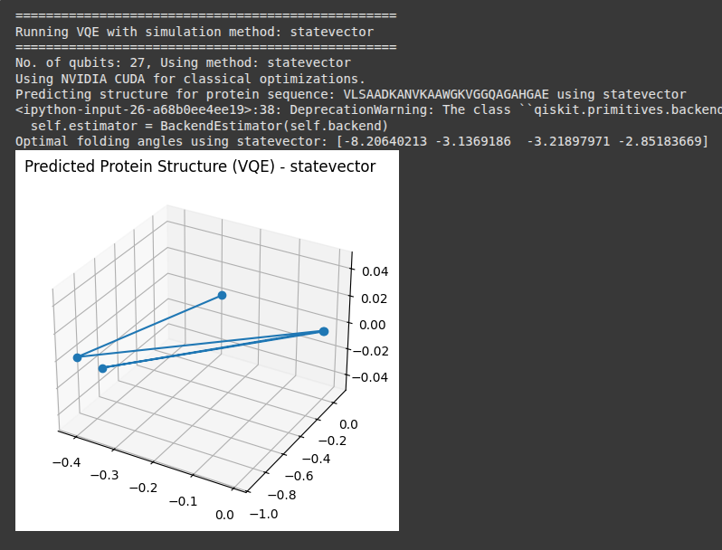
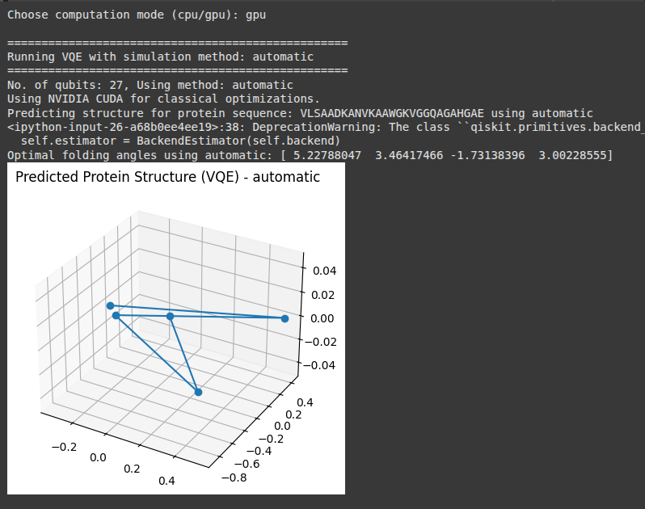

Protein Folding using VQE
==========================

This module implements protein structure prediction using the Variational Quantum Eigensolver (VQE). The class `ProteinFoldingVQE` maps a protein sequence into a qubit Hamiltonian and estimates the ground state configuration.

Module Overview
---------------

.. automodule:: your_module_name
   :members:
   :undoc-members:
   :show-inheritance:

Class Summary
-------------

.. autoclass:: your_module_name.ProteinFoldingVQE
   :members:
   :undoc-members:
   :show-inheritance:

Usage Example
-------------

.. code-block:: python

   from your_module_name import ProteinFoldingVQE

   protein_sequence = "VLSAADKANVKAAWGKVGGQAGAHGAE"
   compute_mode = "cpu"
   method = "statevector"

   folding_vqe = ProteinFoldingVQE(protein_sequence, method, compute_mode)
   folding_vqe.predict_structure()

Expected Output
---------------

Sample console output:

.. code-block:: text

   No. of qubits: 28, Using method: statevector
   Using CPU for classical optimizations.
   Predicting structure for protein sequence: VLSAADKANVKAAWGKVGGQAGAHGAE using statevector
   Optimal folding angles using statevector: [-3.14  0.42 -1.83 ...]

Simulation Methods Comparison
=============================

Below are the protein folding structures obtained using different Qiskit AerSimulator backends. Each simulation method has unique trade-offs in performance and accuracy.

Statevector
-----------

Simulates the exact quantum state using a full statevector. Ideal for small, low-qubit systems.

Automatic
---------

Allows Qiskit Aer to automatically choose the optimal simulation method based on the circuit's structure and backend capabilities.

Dense Matrix
------------

Represents the quantum system using dense matrices. Provides general-purpose simulation at the cost of increased memory usage.

.. image:: ../_static/vqe_densematrix.png
   :alt: Protein structure plot using dense matrix method
   :align: center
   :width: 600px

Matrix Product State (MPS)
--------------------------

An efficient, approximate simulation method using tensor networks. Suitable for simulating large systems with low entanglement.

.. image:: ../_static/vqe_matrixproductstate.png
   :alt: Protein structure plot using matrix product state
   :align: center
   :width: 600px

Dependencies
------------

This script depends on the following libraries:

- Qiskit
- Qiskit Aer
- Qiskit Algorithms
- PyTorch
- NumPy
- Matplotlib

