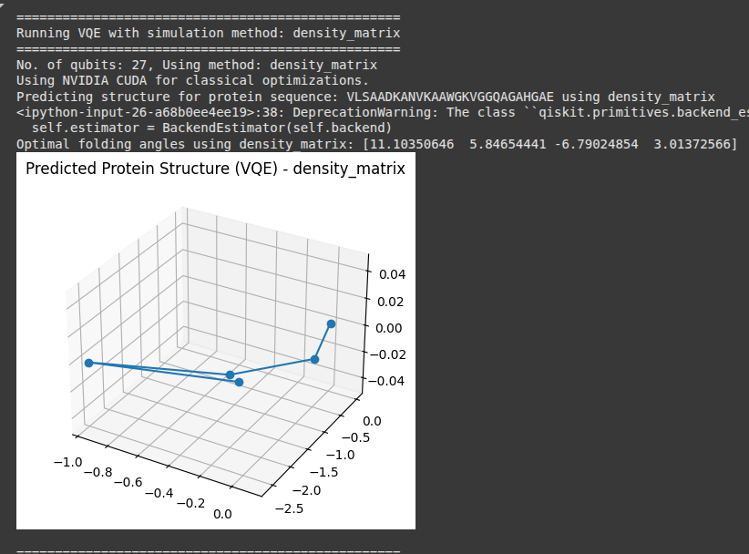
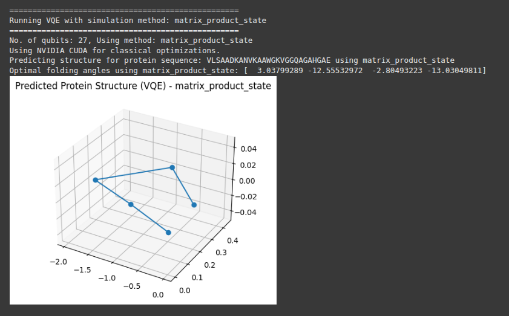

Protein Folding using Variational Quantum Eigensolver (VQE)
===========================================================

This project explores protein structure prediction using the Variational Quantum Eigensolver (VQE) approach, implemented through Qiskit. The simulation maps a protein sequence to a qubit-based Hamiltonian system and estimates its ground state configuration — interpreted here as a potential folding conformation of the protein.

Overview
--------

The simulation takes a given amino acid sequence and predicts its folded structure by minimizing the energy of a corresponding quantum system. Here's how the pipeline works:

1. **Hamiltonian Construction**:
   A simple Hamiltonian is defined using Pauli-Z interactions (`ZZ`) between adjacent qubits. Each residue in the protein sequence corresponds to a qubit, so the Hamiltonian reflects nearest-neighbor interactions across the chain.

2. **Ansatz Preparation**:
   The VQE uses a hardware-efficient ansatz from Qiskit's `RealAmplitudes` class. For efficiency, the number of repetitions (`reps`) is set to 1, minimizing circuit depth.

3. **Estimator Setup**:
   The quantum expectation value is estimated using Qiskit's `BackendEstimator` powered by `AerSimulator`. Various backend simulation methods (like `statevector`, `matrix_product_state`, etc.) are tested in succession.

4. **Classical Optimization**:
   The classical optimizer used is COBYLA, which performs parameter tuning to find the minimum eigenvalue (lowest energy) configuration.

5. **Ground State Estimation**:
   The system is solved using VQE to find optimal parameters representing the ground state of the quantum system.

6. **Parameter Mapping**:
   The optimized parameters are converted into dihedral angles that represent residue rotations in the protein chain.

7. **3D Structure Visualization**:
   The folding angles are used to iteratively build a 3D coordinate chain representing the folded protein structure. This is visualized using `matplotlib`.

Hardware-Aware Execution
------------------------

This implementation supports both **CPU** and **GPU** backends for classical optimization:

- If a CUDA-enabled GPU is available and selected, PyTorch leverages it to speed up optimization.
- Otherwise, CPU computation is used by default.

Dynamic Simulation Method Evaluation
------------------------------------

The simulation iterates through all available Qiskit Aer simulation methods (e.g., `statevector`, `automatic`, `dense_matrix`, `matrix_product_state`) and runs a full VQE prediction for each. This enables empirical evaluation of simulation trade-offs.

Sample Console Output
---------------------

An example execution might produce the following:

.. code-block:: text

   No. of qubits: 28, Using method: matrix_product_state
   Using CPU for classical optimizations.
   Predicting structure for protein sequence: VLSAADKANVKAAWGKVGGQAGAHGAE using matrix_product_state
   Optimal folding angles using matrix_product_state: [-2.71 -1.23  0.99  ...]

Visual Output
-------------

Each simulation method produces a corresponding 3D structural plot of the predicted protein conformation. Below are visualizations from different simulation methods:

Statevector
^^^^^^^^^^^

Automatic
^^^^^^^^^

Dense Matrix
^^^^^^^^^^^^

Matrix Product State (MPS)
^^^^^^^^^^^^^^^^^^^^^^^^^^

Limitations and Notes
---------------------

- This model is **not biophysically accurate** and serves as a conceptual demonstration of VQE for protein folding.
- The Hamiltonian uses only nearest-neighbor `ZZ` interactions and does not model complex biochemical energetics.
- PyTorch is used solely to manage CPU/GPU execution contexts and is not directly involved in the quantum computation.

Dependencies
------------

Ensure the following libraries are installed:

- `qiskit`
- `qiskit-aer`
- `qiskit-algorithms`
- `torch`
- `numpy`
- `matplotlib`

Conclusion
----------

This implementation provides a simplified and extensible framework to explore quantum variational algorithms applied to structured biological prediction problems, while allowing for backend-aware performance benchmarking.
